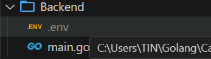
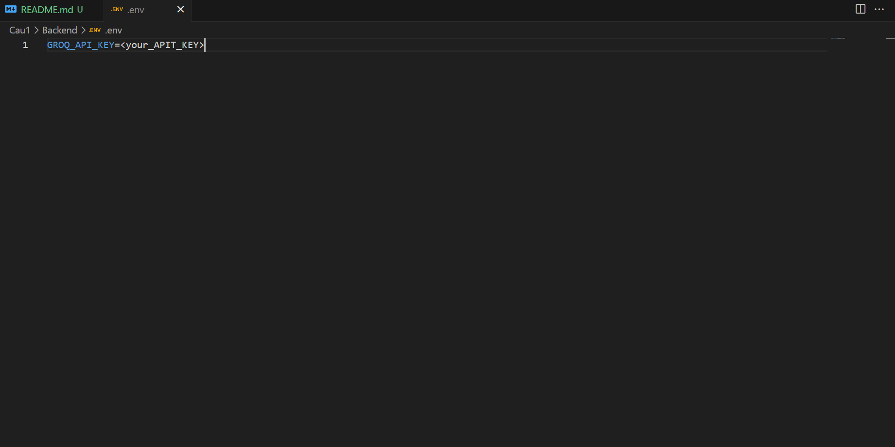
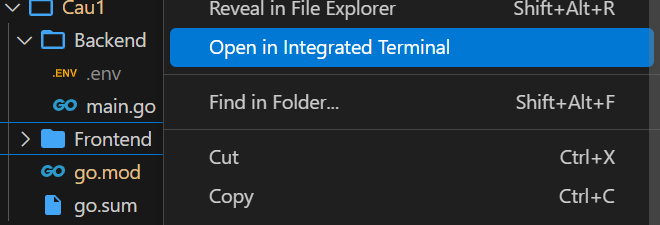
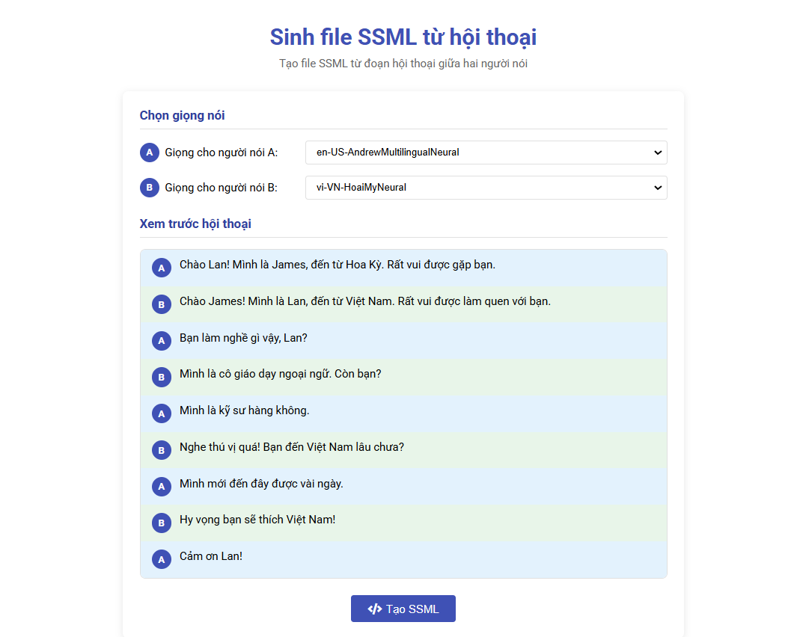
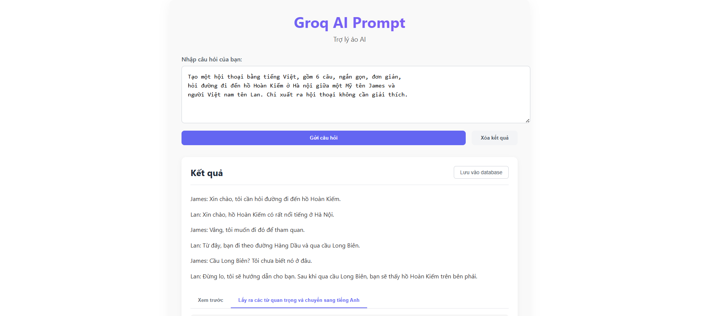
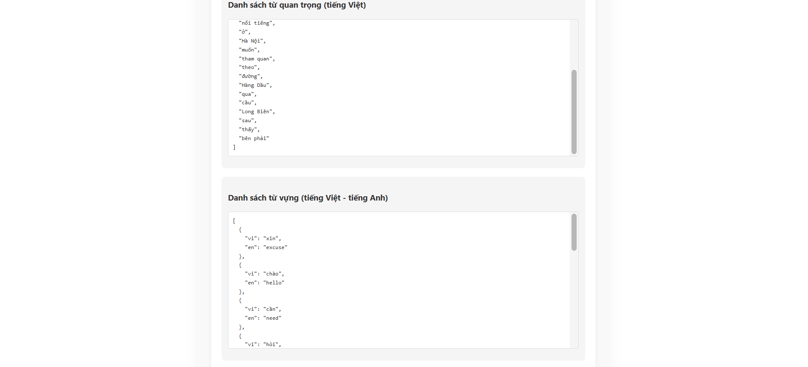

## 🛠 Cài đặt môi trường
1. **Visual Studio Code**: [Download tại đây](https://code.visualstudio.com/)
2. **Node.js**: 
   - Cài đặt bản LTS từ [trang chủ Node.js](https://nodejs.org/)
   - 
3. **Golang**:
   - Tải bản mới nhất từ [golang.org](https://go.dev/dl/)
   - 

---

# Tên Dự Án 
Dự án 1

## Mô tả
Xây dựng ứng dụng web Golang dùng Iris framework có một ô text area cho người dùng viết promp
ấn nút gửi đi, ứng dụng gọi vào Groq API và trả về kết quả cho người dùng xem. 

## Cách chạy
- Sử dụng VScode
- Vào mục Backend tạo file .env rồi thêm GROQ_API_KEY = "your api key"

- Bật terminal thự mục rồi gõ: 
    + 
    + go mod init project, để giúp quản lý dependencies (thư viện, package) cho dự án
    + go run main.go, để chạy dự án

- Vào mục Frontend mở terminal rồi gõ:
    + 
    + Set-ExecutionPolicy -ExecutionPolicy RemoteSigned -Scope Process, để cấp quyền nếu bạn dùng window
    + ng serve, để chạy dự án 

- Vào mạng truy cập http://localhost:4200/ để test 

# Tên Dự Án 
Dự án 2

## Mô tả
Xây dựng ứng dụng web sinh file SSML từ hội thoại

## Cách chạy
- Sử dụng VScode
- Vào mục Frontend mở terminal rồi gõ:
    + 
    + Set-ExecutionPolicy -ExecutionPolicy RemoteSigned -Scope Process, để cấp quyền nếu bạn dùng window
    + ng serve, để chạy dự án 

- Vào mạng truy cập http://localhost:4200/ để test 

# Tên Dự Án 
Dự án 3

## Mô tả
lập trình một ứng dụng web dùng Iris framework gọi vào Groq API, model deepseek-r1-distill-llama-70b để tự động hóa việc sinh ra 1 cuộc trò chuyện rồi lọc ra các từ quan trọng và dịch ra tiếng anh rồi lưu vào postgresql

## Cách chạy
- Sử dụng VScode
- Vào mục Backend tạo file .env rồi thêm GROQ_API_KEY = "your api key"

- Vào mục Backend/Postgresql/db.go để sửa user="tên người dùng" password="mật khẩu" dbname="Tên database" theo database ở Postgresql

- Bật terminal thự mục rồi gõ: 
    + go mod init project, để giúp quản lý dependencies (thư viện, package) cho dự án
    + go run main.go, để chạy dự án

- Vào mục Frontend mở terminal rồi gõ:
    + 
    + Set-ExecutionPolicy -ExecutionPolicy RemoteSigned -Scope Process, để cấp quyền nếu bạn dùng window
    + ng serve, để chạy dự án 

- Vào mạng truy cập http://localhost:4200/ để test 

